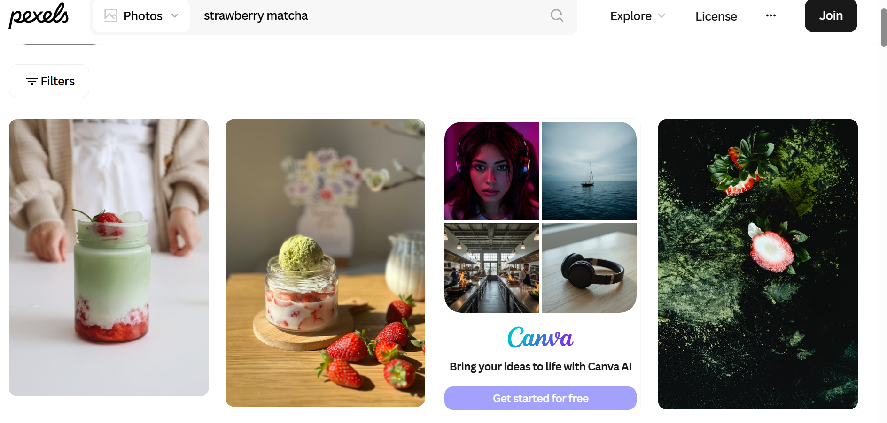
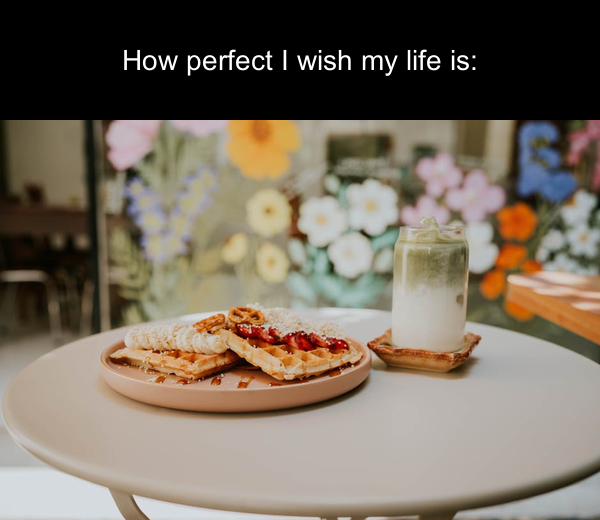

```{r setup}
knitr::opts_chunk$set(echo=TRUE, message=FALSE, warning=FALSE, error=FALSE)

library(tidyverse)

selected_photos <- read_csv("selected_photos.csv")
```


```{css echo=FALSE}

body {
  background-color: #f5f1e8;
  color: #2c2c2c;
  font-family: Arial, sans-serif;
}


h1, h2, h3 {
  color: #3e4a3f;
}


pre {
  background-color: #f0f0f0;
  padding: 10px;
  border-radius: 8px;
}


a {
  color: #6b8e23;
}
```

## Introduction

The two words I used to search for photos on Pexels were **“strawberry”** and **“matcha.”** I chose these words because I am a big fan of strawberry matcha drinks, so it was the first thing that came to my mind when deciding on a theme. I also liked the idea of working with something visually appealing, as the combination of red strawberries and green matcha creates a really nice colour contrast. 

The URL used for this search is:
[Strawberry Matcha](https://www.pexels.com/search/strawberry%20matcha/)

Below is a screenshot of the first row of photos returned from the search:


From looking at the photos on Pexels, I noticed a few common features. First, many of the images use **soft and natural lighting**, which makes the drinks look more fresh and appealing. Second, most of the photos have a **simple or clean background**, such as a table or café setting, so that the focus stays on the drink itself. Lastly, there is a **strong and consistent colour contrast** between the red strawberries and green matcha, which makes the images stand out and look aesthetically pleasing.

```{r}
selected_photos %>%
  select(url) %>%
  knitr::kable(caption = "URLs of Selected Photos")
```

## Key features of my selected photos

```{r}

mean_width <- mean(selected_photos$width, na.rm = TRUE)

median_height <- median(selected_photos$height, na.rm = TRUE)

mean_aspect_ratio <- mean(selected_photos$aspect_ratio, na.rm = TRUE)

total_photos <- nrow(selected_photos)

```
The average width of the selected photos is `r round(mean_width, 2)` pixels.

The median height of the photos is `r round(median_height, 2)` pixels, which represents the typical image height.

The average aspect ratio is `r round(mean_aspect_ratio, 2)`, indicating that most images are wider than they are tall.

A total of `r total_photos` photos were selected after filtering for landscape orientation.


## Creativity
Below is my strawberry matcha meme, yumz:


In this project, I create the meme using one of the images from my selected dataset. I chose to relate the meme to life, like how I wish my life is as perfect as the image that I use in the meme. I used skills from Modules 1 and 2, especially working with the {magick} package. Functions that I used are **image_read()** to import images from URLs, **image_annotate()** to add text onto the image, and **image_write()** to save the final meme. I also used image resizing and layout techniques to improve how the meme looks. I resized the image using **image_resize()** so that it had a consistent size and was not too large or blurry. This helped make sure the text and image were balanced and easy to view. For the layout, I created separate text bars and combined them with the image using **image_append()**. This allowed me to place the text clearly at the top instead of overlapping it on the image, which makes the meme more readable. 

## Learning reflection

One important idea I learned from Module 3 is how creating new variables can change the way data is interpreted. Using **mutate()**, I was able to derive new variables such as aspect ratio and orientation from the original width and height variables. For example, calculating aspect ratio allowed me to quantify whether images are more horizontal or vertical, rather than just visually guessing. I also learned that structuring data into a tidy format makes it easier to apply functions like **filter()** and **summarise()**, which improves both efficiency and clarity when analysing datasets.

This project also made me more curious about how APIs work in practice, especially how data is requested, returned in JSON format, and then transformed into a tidy data frame in R. I would like to learn more about data visualisation techniques in R. Overall, this project helped me see how data transformation and data retrieval are connected.

## Appendix
```{r file='exploration.R', eval=FALSE, echo=TRUE}

```
```{r file='project3_report.Rmd', eval=FALSE, echo=TRUE}

```


